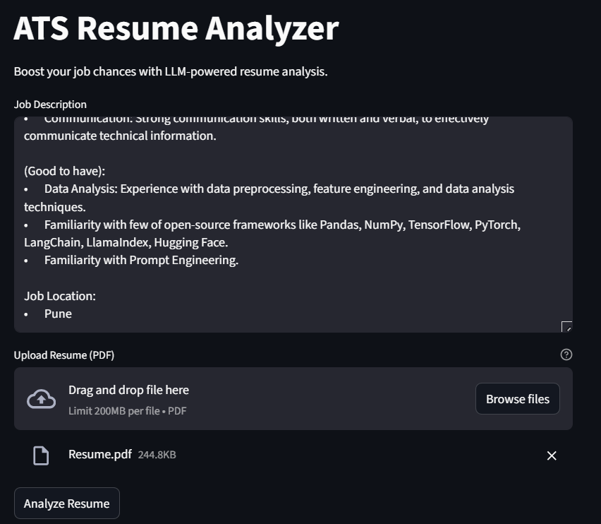
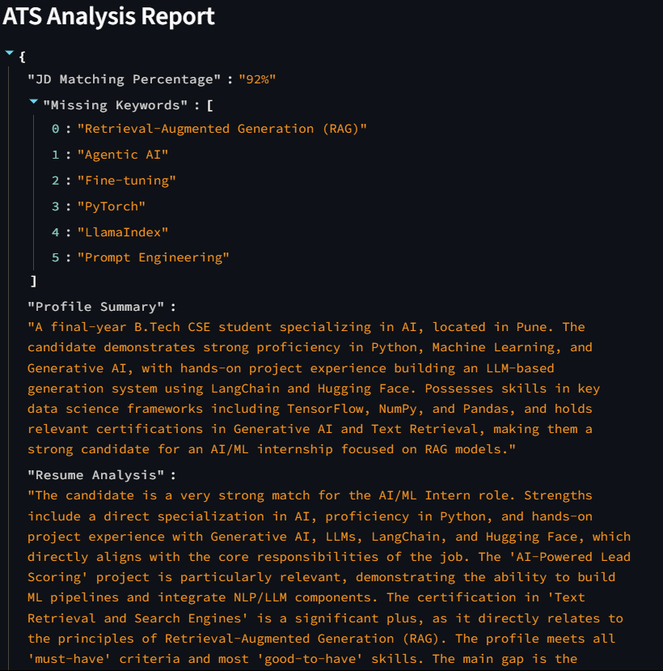

# 📄 ResuMatch: LLM-Powered ATS Tool

ResuMatch is an intelligent, AI-driven resume analysis web app that leverages Google's Gemini Pro (LLM) to simulate an Applicant Tracking System (ATS). It helps candidates compare their resumes against a given job description and provides insights like matching percentage, missing keywords, and improvement suggestions — all through a simple and interactive Streamlit interface.

---

## 🚀 Features

- ✅ Resume analysis using Google's Gemini LLM
- 📌 JD vs Resume matching percentage
- 🔍 Missing keyword extraction
- 🧠 Smart profile summary and suggestions
- 📄 PDF resume parsing
- 📥 Downloadable ATS report (JSON)
- 🌐 Streamlit-based user interface

---

## 📷 Screenshots

---

## 🛠️ Tech Stack

- **Python**
- **Streamlit**
- **Google Generative AI (Gemini 1.5 Pro / 2.5 Pro)**
- **PyPDF2**
- **dotenv**

---
